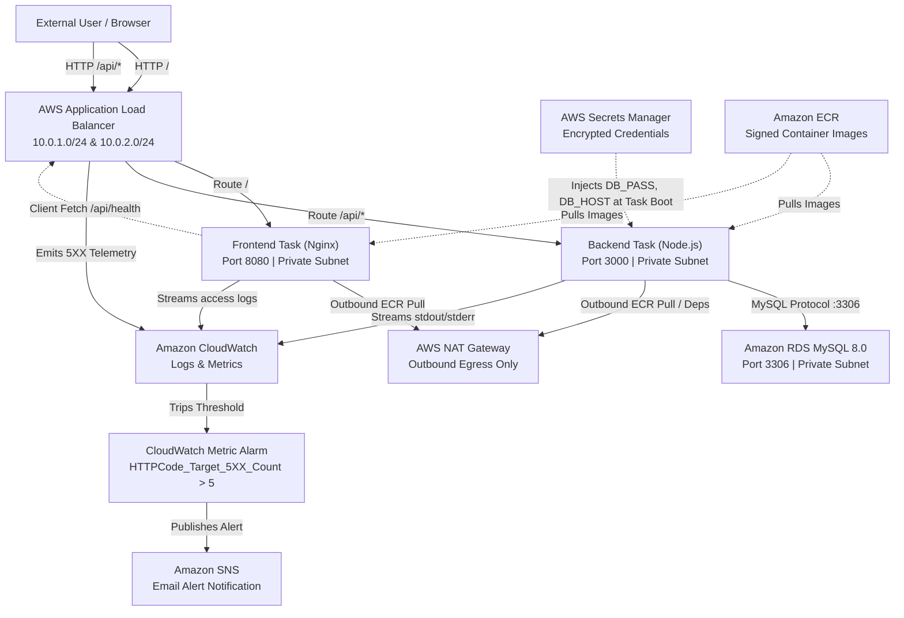
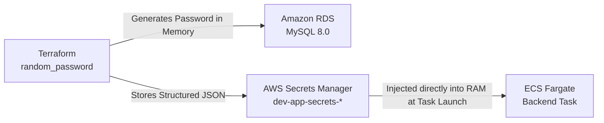
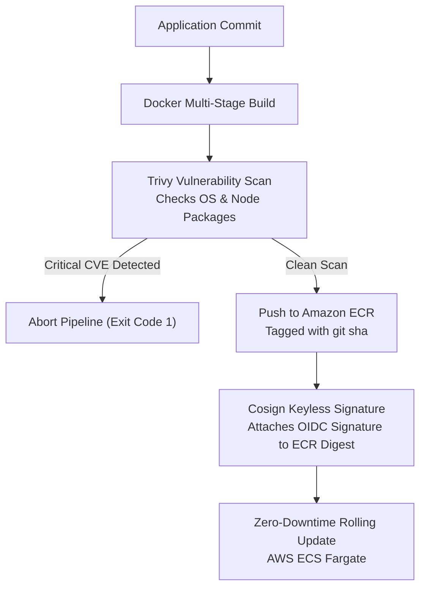

<div align="center">

# 3-Tier Cloud Platform & Pipeline DevOps Task

### Production-Grade Automated Cloud Architecture on AWS

**Terraform • AWS ECS Fargate • Amazon RDS MySQL 8.0 • AWS Secrets Manager • GitHub Actions (OIDC) • Trivy • Cosign • CloudWatch • Docker Compose**

<br>


<br>

An fully automated cloud platform provisioning a hardened 3-tier web application on **Amazon Web Services (AWS)** using **Terraform** and **GitHub Actions**. This implementation enforces a 100% keyless CI/CD architecture via **AWS OIDC**, zero-plaintext secrets management using **AWS Secrets Manager**, container security through **Trivy vulnerability scanning** and **Cosign cryptographic signing**, network micro-segmentation across public and private subnets, and real-time observability through **Amazon CloudWatch** logs, metrics, and automated alarms.

</div>

---

## Table of Contents

1. [Platform Overview](#platform-overview)
2. [Quick Start](#quick-start)
3. [Architecture & Complete Platform Flow](#architecture--complete-platform-flow)
4. [Prerequisites](#prerequisites)
5. [Local Development with Docker Compose](#local-development-with-docker-compose)
6. [Infrastructure as Code (Terraform)](#infrastructure-as-code-terraform)
7. [Secrets Management: Zero-Plaintext Architecture](#secrets-management-zero-plaintext-architecture)
8. [Containerization & Supply Chain Security (Trivy + Cosign)](#containerization--supply-chain-security-trivy--cosign)
9. [Continuous Integration & Continuous Deployment (CI/CD)](#continuous-integration--continuous-deployment-cicd)
10. [Monitoring, Observability & Alerting (CloudWatch + SNS)](#monitoring-observability--alerting-cloudwatch--sns)
11. [System Verification & Live Testing](#system-verification--live-testing)
12. [Architectural Trade-offs & Production Roadmap](#architectural-trade-offs--production-roadmap)


---

## Platform Overview

This platform deploys an isolated, highly available 3-tier architecture designed around least-privilege security and automated operations:

| Tier | Component / Service | Technology | Responsibility | Network Placement | Port |
|---|---|---|---|---|---|
| **Tier 1** | Web UI (SPA) | Nginx (Unprivileged Alpine) | Serves responsive, CSS-driven UI | Private Subnet | 8080 (Internal) |
| **Tier 2** | Backend API | Node.js 22 LTS (Alpine) | Business logic, health, metrics, DB pooling | Private Subnet | 3000 (Internal) |
| **Tier 3** | Managed Database | Amazon RDS (MySQL 8.0) | Persistent storage, KMS encrypted storage | Private Subnet | 3306 (Internal) |
| **Ingress**| Load Balancer | AWS Application Load Balancer | SSL/HTTP entrypoint, path-based routing | Public Subnets | 80 / 443 |
| **Egress** | NAT Gateway | AWS NAT Gateway + Elastic IP | Egress-only internet access for private tasks | Public Subnet | Outbound |

```text
Target Environment: AWS (us-east-1)
Public Entrypoint:  http://dev-alb-1624663385.us-east-1.elb.amazonaws.com
Database Host:      dev-mysql-db.c83sggyye8aus.us-east-1.rds.amazonaws.com (Private DNS)

Those are environment based exmamples of the real archtiecture.
```

---

## Quick Start

```bash
git clone https://github.com/ahmeddhussain/Assesment-Task.git
cd Assesment-Task
```

### 1. Test Locally with Docker Compose
```bash
docker compose up --build
```
#### Endpoints:
* Frontend UI: `http://localhost:8080`
* Backend Metrics: `http://localhost:3000/metrics`
* Local Database: `localhost:3306` (MySQL 8.0)

### 2. Provision AWS Infrastructure via GitHub Actions
1. Navigate to **Actions** → **Terraform Infrastructure Operations** → **Run workflow**.
2. Select Target Environment: `dev`.
3. Select Action: `apply`.
4. Run workflow. Terraform automatically provisions the dual-AZ VPC, NAT Gateway, RDS MySQL 8.0, Secrets Manager, ALB, and ECS Fargate Cluster.

### 3. Deploy Application Containers
Push any change under `app/**` to `main`, or re-run the **Application Build, SecScan & Deploy** workflow.
* Runs Node.js unit tests.
* Builds multi-stage Docker images.
* Scans for OS and library CVEs with **Trivy** (fails on `CRITICAL`).
* Cryptographically signs images with **Cosign**.
* Pushes to Amazon ECR and initiates a zero-downtime rolling update on ECS Fargate.

### 4. Verify Live Cloud Deployment
Open the ALB DNS name in any browser:
```text
http://dev-alb-1624663385.us-east-1.elb.amazonaws.com/
```
The page performs an asynchronous health verification and displays **SUCCESS** when 3-tier connectivity is established.

---

## Architecture & Complete Platform Flow

### High-Level Network & Infrastructure Topology


### Complete Platform Flow (Mermaid)



---

## Prerequisites

* **Docker & Docker Compose** (for local verification).
* **AWS Account** with administrative permissions to VPC, RDS, ECS, ECR, Secrets Manager, IAM, and CloudWatch.
* **AWS CLI (v2)** configured locally for testing.
* **Terraform (>= 1.10.0)** (required for native S3 state locking via `use_lockfile = true`).
* **GitHub Repository** with Actions enabled.

---

## Local Development with Docker Compose

Local development replicates the 3-tier cloud architecture using Docker Compose, spinning up an ephemeral MySQL 8.0 instance with built-in health checking.

```bash
docker compose up --build
```

### Services Configuration

* **`devops-db`**: MySQL 8.0 initialized with health checks via `mysqladmin ping`.
* **`devops-backend`**: Node.js 22 container configured with `depends_on: { db: { condition: service_healthy } }`. It establishes an asynchronous connection pool and exposes `/health` and `/metrics`.
* **`devops-frontend`**: Nginx container running as unprivileged user `nginx` on port 8080, serving the responsive status UI.

### Verification

```bash
# Verify all three containers are healthy
docker compose ps

# Verify API and DB connection
curl http://localhost:3000/health
# Response: {"status":"UP","database":"CONNECTED"}

# Verify internal metrics
curl http://localhost:3000/metrics
# Response: {"uptime_seconds":15.4,"memory_rss_bytes":32104448,"memory_heap_used_bytes":5129840}
```

Open `http://localhost:8080` in your browser to confirm the UI displays **SUCCESS**.


 

**Note**: The provided screenshots provides the application behaviour on services successful and failed connection.

### Tear Down
```bash
docker compose down -v
```
---

## Infrastructure as Code (Terraform)

Infrastructure is managed entirely through modularized Terraform code located under `terraform/` with `dependency waiting` and `native S3 state locking ` mechanisms.

### Directory Layout

```text
terraform/
├── backend.tf                  # S3 Remote State with native S3 locking (TF 1.10+)
├── providers.tf                # AWS Provider configuration with default_tags
├── variables.tf                # Global input variables
├── main.tf                     # Root orchestration module
├── outputs.tf                  # ALB DNS and RDS Endpoint outputs
└── modules/
    ├── networking/             # VPC, Public/Private Subnets, IGW, NAT Gateway, Route Tables
    ├── database/               # RDS MySQL 8.0, Subnet Group, KMS Encryption, Random Password
    ├── secrets/                # AWS Secrets Manager secret & JSON version configuration
    ├── compute/                # ALB, Target Groups, ECS Fargate Cluster, Task Defs, IAM
    └── monitoring/             # CloudWatch Metric Alarms, SNS Topic, Email Subscription
```

### Module Responsibilities & Dependency Flow

Terraform resolves resources through an explicit Directed Acyclic Graph (DAG) that enforces clean separation of concerns and guarantees linear execution without dependency cycles:

$$\text{Networking} \longrightarrow \text{Database} \longrightarrow \text{Secrets} \longrightarrow \text{Compute} \longrightarrow \text{Monitoring}$$

1. **`modules/networking`**:
   * Dual-AZ VPC (`10.0.0.0/16`) spanning `us-east-1a` and `us-east-1b`.
   * Two Public Subnets (`10.0.1.0/24`, `10.0.2.0/24`) attached to an Internet Gateway.
   * Two Private Subnets (`10.0.3.0/24`, `10.0.4.0/24`) routed to a single NAT Gateway with Elastic IP.
2. **`modules/database`**:
   * Provisions an encrypted `db.t3.micro` RDS MySQL 8.0 instance in the private subnets.
   * Generates a 16-character cryptographic string via `random_password`.
   * Outputs the private RDS endpoint and password securely.
3. **`modules/secrets`**:
   * Consolidates `DB_HOST`, `DB_USER`, `DB_PASS`, `DB_NAME`, and `PORT` into a single structured JSON secret inside **AWS Secrets Manager**.
4. **`modules/compute`**:
   * Creates an Application Load Balancer in the public subnets with HTTP listener rules forwarding `/api/*` to the backend and `/` to the frontend.
   * Deploys ECS Fargate services in the private subnets.
   * Deploys ECR for both backend and frontend images used by the CI.
   * Grants the ECS Execution Role scoped access to `secretsmanager:GetSecretValue` and `logs:CreateLogGroup`.
   * Least Privellege IAM roles for each component for seamless communication.
5. **`modules/monitoring`**:
   * Configures an ALB metric alarm on `HTTPCode_Target_5XX_Count > 5` over a 1-minute period.
   * Subscribes an administrative email to an Amazon SNS alert topic.


---

## Secrets Management: Zero-Plaintext Architecture

Static passwords in `.tfvars` files, CI/CD environment variables, or Git commits represent severe security liabilities. This platform uses an automated **Zero-Plaintext** lifecycle:



### Secret JSON Schema Example
```json
{
  "DB_HOST": "dev-mysql-db.c83skyye8aus.us-east-1.rds.amazonaws.com",
  "DB_USER": "dbadmin",
  "DB_PASS": "sUp3r$ecr3tP@ss!",
  "DB_NAME": "devopsdb",
  "PORT": "3000"
}
```

### ECS Kernel-Level RAM Injection
The ECS Task Definition maps JSON keys directly to environment variables using the `secrets` attribute. The secret is never written to disk.

---

## Containerization & Supply Chain Security (Trivy + Cosign)

Both services are containerized following strict production hardening standards:

### Docker Hardening Practices
* **Multi-Stage Builds:** Development tools and package caches are stripped out of the final image.
* **Minimal Base Images:** Built on Alpine Linux (`node:22-alpine` and `nginxinc/nginx-unprivileged:alpine`) to minimize CVE exposure.
* **Non-Root Execution:** Processes run under explicit non-root users (`USER nodeapp` [UID 1000] and `USER nginx` [UID 101]).
* **Native Health Checks:** Built-in `HEALTHCHECK` directives ping `/health` or port 8080 to facilitate orchestration self-healing.

### DevSecOps Supply Chain Pipeline



1. **Vulnerability Scanning (Trivy):**
   * Scans container layers before pushing to ECR.
   * Configured with `exit-code: 1` and `severity: CRITICAL` to enforce a hard security gate.
2. **Cryptographic Signing (Cosign):**
   * Uses Sigstore Cosign to sign container images directly in Amazon ECR via keyless GitHub Actions OIDC tokens.
   * Guarantees that only images built by the authorized CI workflow can run in the cluster.

---

## Continuous Integration & Continuous Deployment (CI/CD)

The repository implements a clean separation between **Infrastructure Operations** and **Application Deployments**.

### 1. Infrastructure Pipeline (`deploy-infra-ci.yml`)
* **Trigger:** Strictly manual (`workflow_dispatch`).
* **Dynamic Inputs:**
  * `environment`: `dev`, `staging`, `prod`
  * `action`: `plan`, `apply`, `destroy`
  * `confirm_destroy`: Required safety text box.
* **Destruction Guardrail:** If an operator selects `destroy`, the pipeline verifies that the string `"destroy"` was explicitly typed into `confirm_destroy`. If not, it terminates with an error.


### 2. Application Pipeline (`app-deploy.yml`)
* **Trigger:** Push to `main` matching `app/**` or manual execution.
* **Stages:**
  1. `test-application`: Runs backend unit tests (`npm test`).
  2. `build-scan-sign-deploy`:
     * Assumes AWS IAM Role via OIDC.
     * Builds Frontend & Backend images tagged with `${{ github.sha }}` and `latest`.
     * Executes Trivy vulnerability scans.
     * Signs images with Cosign.
     * Pushes to ECR and triggers an ECS rolling deployment.
 

  

### Secretless AWS Authentication via OIDC
Static IAM Access Keys (`AKIA...`) are completely eliminated. GitHub Actions exchanges an ephemeral OIDC JSON Web Token (JWT) directly with AWS STS via a trust policy and assumed role.

---

## Monitoring, Observability & Alerting (CloudWatch + SNS)

### Application & Access Logging
* Both ECS Task Definitions use the `awslogs` driver.
* Frontend Nginx access/error logs stream to `/ecs/dev-frontend`.
* Node.js connection, query, and startup logs stream to `/ecs/dev-backend`.


### Metric Collection
* **ECS Fargate:** Automatically pushes `CPUUtilization` and `MemoryUtilization` to CloudWatch every 60 seconds.
* **Application Load Balancer:** Emits real-time time-series telemetry for `RequestCount`, `ActiveConnectionCount`, `ConsumedLCUs`, and error status codes.
  

### Metric Alarm Configuration


* If application targets return **more than 5 HTTP 5XX server errors within 1 minute**, the alarm enters the `ALARM` state and publishes an alert to the `dev-infrastructure-alerts` SNS topic, which sends an immediate email to the configured subscriber.

---

## System Verification & Live Testing

### 1. End-to-End 3-Tier Connectivity Test
Load the public application URL in a web browser:
```text
http://dev-alb-1624663385.us-east-1.elb.amazonaws.com/
```
The client browser fetches the HTML from Nginx, makes an asynchronous GET call to `/api/health`, and renders a green **SUCCESS** card confirming the backend successfully executed `SELECT 1` against RDS MySQL.


### 2. Network Isolation Penetration Test
Verify that the database is completely blocked from the public internet:
```bash
nc -zv -w 3 dev-mysql-db.c83skyye8aus.us-east-1.rds.amazonaws.com 3306
```
* **Result:** `Connection timed out` or `Operation timed out`. Demonstrates that private subnets and security group chaining actively drop external TCP packets.

### 3. Information Disclosure & Perimeter Lockdown Test
Verify that internal metrics and diagnostics cannot be scraped publicly:
```bash
curl -I http://dev-alb-1624663385.us-east-1.elb.amazonaws.com/metrics
curl -I http://dev-alb-1624663385.us-east-1.elb.amazonaws.com/health
```
* **Result:** The ALB forwards these requests to the default frontend handler instead of exposing internal container metrics, keeping diagnostic endpoints strictly private.

### 4. Load Testing & CloudWatch Metric Spike
Generate synthetic load to verify telemetry ingestion:
```bash
for i in {1..100}; do curl -s -o /dev/null -w "%{http_code}\n" http://dev-alb-1624663385.us-east-1.elb.amazonaws.com/; done
```
* **Result:** CloudWatch captures all 100 requests. In the Application ELB dashboard, `RequestCount` displays a sharp peak (reaching 42 requests in the peak 1-minute bucket) and `ActiveConnectionCount` peaks at 19 concurrent connections.


 
### 5. CloudWatch Alarm Notification Test
Verify the end-to-end alerting pipeline using the AWS CLI , for the test i manually disconnected the backend-task to present the 50x erros at the container level:
```bash
aws cloudwatch set-alarm-state \
  --alarm-name "dev-alb-high-5xx-errors" \
  --state-value ALARM \
  --state-reason "Simulating target 5XX spike for DevOps assessment verification"
```
* **Result:** The alarm flips to **RED (`In alarm`)** in the CloudWatch console, and an automated SNS alert email is delivered immediately to the registered inbox.
* **Reset to Normal:**
  ```bash
  aws cloudwatch set-alarm-state --alarm-name "dev-alb-high-5xx-errors" --state-value OK --state-reason "Verification complete"
  ```
  
---


## Architectural Trade-offs & Production Roadmap

In accordance with the 4–6 hour assessment scope and AWS Free Tier / sandbox constraints, specific architectural compromises were made. Here is how this platform would evolve for an enterprise production deployment:

### 1. Core Architectire
* **Assessment State:** Using ECS with ECR and static deploy.
* **Production Evolution:** Using services like k8s on an EC2 server or EKS is prefered with large production applications and seperation between CI/CD by deploying ArgoCD and using a single source of truth method, seperate the application repos to manually confirm the image change deploy to production by initating PR on the app mainfests repo watched by ArgoCD with environment based Architecture.

### 2. High Availability (HA) & Fault Tolerance
* **Assessment State:** RDS MySQL is configured in Single-AZ (`multi_az = false`) to minimize sandbox costs.
* **Production Evolution:** Enable `multi_az = true` on RDS for automated standby failover across availability zones. Implement ECS Service Auto Scaling using Target Tracking policies based on Average CPU Utilization (>70%) and ALB Request Count Per Target.

### 3. Networking & Transit Costs
* **Assessment State:** A single NAT Gateway is deployed in `us-east-1a` to service both private subnets, avoiding duplicate ~$32/month charges.
* **Production Evolution:** Deploy one NAT Gateway per Availability Zone to eliminate cross-AZ failure domains. Implement **AWS PrivateLink (VPC Endpoints)** for ECR, S3, Secrets Manager, and CloudWatch to keep container traffic entirely on the AWS private network backbone, bypassing NAT data processing fees entirely.

### 4. Edge Security & Encryption
* **Assessment State:** ALB listens on HTTP (Port 80) to avoid requiring a custom registered domain name.
* **Production Evolution:** Provision a custom domain managed under **Amazon Route 53**, issue an **AWS Certificate Manager (ACM)** public SSL certificate, and enforce HTTP-to-HTTPS automatic redirection on the ALB. Attach **AWS WAF (Web Application Firewall)** to the ALB to protect against OWASP Top 10 vulnerabilities (SQLi, XSS) and rate-limit abusive IPs.

### 5. Cost Optimization
* **Production Evolution:**
  * Adopt **AWS Fargate Spot** for non-critical workloads, background workers, or staging environments (up to 70% cost reduction).
  * Baseline compute usage and purchase 1-year or 3-year **AWS Compute Savings Plans**.
  * Enable Amazon RDS Storage Autoscaling rather than over-allocating static disk space upfront.

---
