<div align="center">

# 3-Tier Cloud Platform & Pipeline DevOps Task
 
### Serverless Automated Cloud Architecture on AWS

**Terraform • AWS ECS Fargate • Amazon RDS MySQL 8.0 • AWS Secrets Manager • GitHub Actions (OIDC) • Trivy • Cosign • CloudWatch • Docker Compose**

<br>


<br>


A fully automated cloud platform provisioning a hardened 3-tier web application on **Amazon Web Services (AWS)** using **Terraform** and **GitHub Actions**. The platform enforces keyless CI/CD through **AWS OIDC**, zero-plaintext secrets via **AWS Secrets Manager**, container vulnerability scanning with **Trivy**, cryptographic provenance signing with **Cosign**, network micro-segmentation across public and private subnets, and observability via **Amazon CloudWatch** logs, metrics, and automated alarms.

</div>

---

## Table of Contents

1. [Platform Overview](#platform-overview)
2. [Why AWS and ECS Fargate](#why-aws-and-ecs-fargate)
3. [Architecture](#architecture)
4. [Prerequisites](#prerequisites)
5. [Local Development with Docker Compose](#local-development-with-docker-compose)
6. [Cloud Setup & Deployment (One-Time Bootstrap)](#cloud-setup--deployment-one-time-bootstrap)
7. [Infrastructure as Code (Terraform)](#infrastructure-as-code-terraform)
8. [Security & Least Privilege](#security--least-privilege)
9. [Secrets Management](#secrets-management)
10. [Containerization & Supply Chain Security](#containerization--supply-chain-security)
11. [CI/CD Pipelines](#cicd-pipelines)
12. [Monitoring, Logging & Alerting](#monitoring-logging--alerting)
13. [System Verification & Live Testing](#system-verification--live-testing)
14. [Trade-offs & Cost Notes](#trade-offs--cost-notes)
15. [Production Considerations](#production-considerations)


---

## Platform Overview

This platform deploys an isolated 3-tier architecture with least-privilege security boundaries:

| Tier | Component | Technology | Responsibility | Network Placement | Port |
|---|---|---|---|---|---|
| **Tier 1** | Web UI (SPA) | Nginx (Unprivileged, Alpine) | Serves responsive status UI | Private Subnet | 8080 (Internal) |
| **Tier 2** | Backend API | Node.js 22 LTS (Alpine) | Business logic, health, metrics, DB connection pooling | Private Subnet | 3000 (Internal) |
| **Tier 3** | Managed Database | Amazon RDS MySQL 8.0 | Persistent storage, KMS encrypted storage | Private Subnet | 3306 (Internal) |
| **Ingress** | Load Balancer | AWS Application Load Balancer | HTTP entrypoint, header sanitization, path-based routing | Public Subnets | 80 |
| **Egress** | NAT Gateway | AWS NAT Gateway + Elastic IP | Outbound-only internet egress for private tasks | Public Subnet | Outbound |

```text
Target Environment: AWS (us-east-1)
Public Entrypoint:  http://dev-alb-1624663385.us-east-1.elb.amazonaws.com
Database Host:      dev-mysql-db.c83skyye8aus.us-east-1.rds.amazonaws.com (Private DNS)
```
> *Note: Hostnames represent verified assessment run instances. The environment is destroyed after verification to prevent continuous sandbox charges.*

---

## Why AWS and ECS Fargate

* **AWS Ecosystem:** Broadest managed-service coverage required for this architecture (VPC, RDS, ALB, Secrets Manager, CloudWatch) with native GitHub Actions OIDC federation, eliminating long-lived stored credentials.
* **ECS Fargate over EC2 / EKS:** Eliminates operating system patching and node management overhead. Provides per-task IAM roles with a smaller operational attack surface than Kubernetes for a two-container application, fitting a 4–6 hour assessment scope while demonstrating production-grade infrastructure decisions.
* **Amazon RDS over In-Cluster Database:** Offloads snapshot backups, automated minor engine patching, and storage-level encryption to AWS, completely separating database lifecycle from ephemeral application containers.
* **Modular Terraform:** Preferred IaC tool; ensures strict separation of concerns, DRY code, and reusable modules across environments.

---

## Architecture

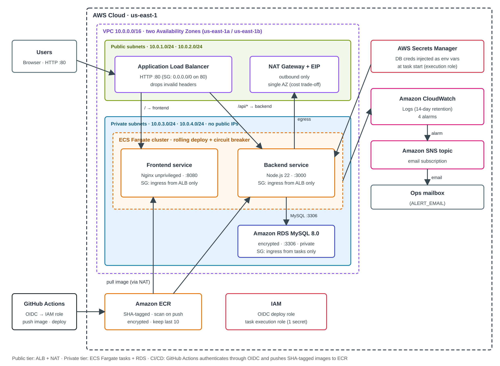

### Request Flow
1. **Ingress:** Clients reach the internet-facing **Application Load Balancer (ALB)** on port 80 across public subnets.
2. **Routing:** ALB forwards `/api/*` to the **backend** target group and default `/` traffic to the **frontend** target group.
3. **Compute Isolation:** Frontend and backend run as **ECS Fargate tasks in private subnets** without public IP addresses. Security groups accept ingress strictly from the ALB security group.
4. **Data Isolation:** Backend tasks communicate with **Amazon RDS MySQL 8.0** over port 3306. The RDS security group permits inbound traffic strictly from the backend ECS task security group, with no blanket egress rule.
5. **Runtime Secret Injection:** At task boot, ECS dynamically fetches credentials from **AWS Secrets Manager** and injects them directly into the backend container's memory via the task execution role.
6. **Egress:** Private tasks route through an **AWS NAT Gateway** in the public subnet for external dependencies (ECR image pulls and AWS API endpoints).
7. **Observability:** Tasks stream logs to **CloudWatch Logs**, four metric alarms monitor system health, and alerts publish to an **SNS topic** that notifies subscribed emails.

---

## Prerequisites

* **Docker & Docker Compose** (for local runs).
* **AWS CLI v2** configured for bootstrap and testing commands.
* **Terraform >= 1.10.0** (required for native S3 state locking via `use_lockfile = true`).
* **GitHub Repository** with Actions enabled.

---

## Local Development with Docker Compose

Docker Compose runs a local MySQL 8.0 instance (with health checks), the backend API, and the frontend server.

```bash
git clone https://github.com/ahmeddhussain/Assesment-Task.git
cd Assesment-Task
docker compose up --build
```

> **Local Credentials Isolation:** Credentials in `docker-compose.yaml` are throwaway development values bound to `127.0.0.1`. Production cloud credentials are generated cryptographically by Terraform and stored in Secrets Manager.

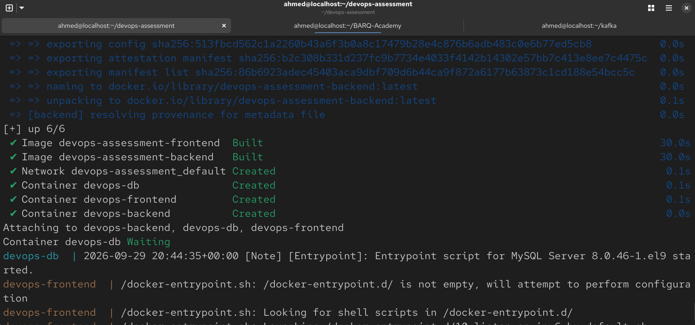

### Endpoints
* Frontend UI: `http://localhost:8080`
* Backend Health: `http://localhost:3000/health`
* Backend Metrics: `http://localhost:3000/metrics`
* Database: `localhost:3306`

### Verification
```bash
docker compose ps
curl http://localhost:3000/health
# Response: {"status":"UP","database":"CONNECTED"}

curl http://localhost:3000/metrics
# Response: {"uptime_seconds":15.4,"memory_rss_bytes":32104448,"memory_heap_used_bytes":5129840}
```

Open `http://localhost:8080`. The client-side status UI dynamically reflects the state of the 3-tier connectivity:

| Backend Disconnected (Failure State) | 3-Tier Connected (Success State) |
| :---: | :---: |
| 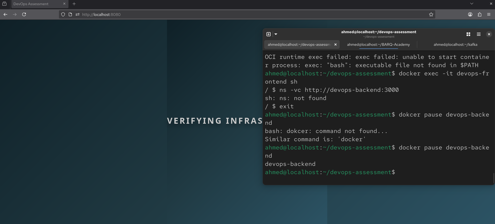 | 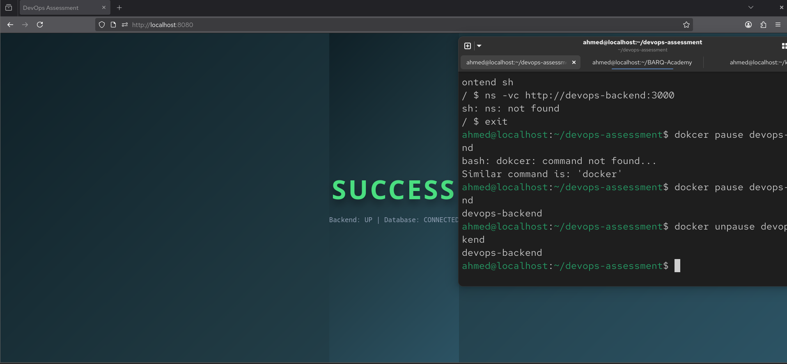 |

```bash
docker compose down -v
```

---

## Cloud Setup & Deployment (One-Time Bootstrap)

To prevent chicken-and-egg dependency locks, the S3 state bucket and GitHub Actions IAM OIDC provider are configured once out-of-band before Terraform executes.

### 1. Configure the S3 State Storage Bucket
Create an S3 bucket via the console to enable
`State locking` which uses native S3 conditional writes (`use_lockfile = true`) in Terraform 1.10+, eliminating DynamoDB costs.

### 2. Configure GitHub Actions OIDC Provider & IAM Role
1. **Identity Provider:** Open **IAM** → **Identity Providers** → **Add Provider** (`OpenID Connect`, URL: `https://token.actions.githubusercontent.com`, Audience: `sts.amazonaws.com`).
2. **IAM Role Trust Policy:** Create `github-actions-assessment-role` .

#### Required Role Permissions
* **Terraform Infrastructure Workflow:** Scoped policies to manage VPC, RDS, ECS, ECR, ELB, IAM, Secrets Manager, CloudWatch, SNS, KMS, and S3 state operations.
* **Application Deployment Workflow:** `ecr:GetAuthorizationToken`, ECR push permissions, `ecs:DescribeTaskDefinition`, `ecs:RegisterTaskDefinition`, `ecs:UpdateService`, `ecs:DescribeServices`, and `iam:PassRole` on task and execution roles.

### 3. Configure GitHub Repository Secrets
Navigate to **Settings → Secrets and variables → Actions** and set:

| Secret Name | Description | Example Value |
|---|---|---|
| `AWS_ROLE_ARN` | IAM Role ARN configured for OIDC | `arn:aws:iam::800770414458:role/github-actions-assessment-role` |
| `ALERT_EMAIL` | Destination email for SNS alerts | `operator@example.com` *(keeps personal data out of code)* |

### 4. Deploy Infrastructure via GitHub Actions
1. Open **Actions → Terraform Infrastructure Operations → Run workflow**.
2. Select target environment: `dev`, action: `apply`, and trigger.
3. Confirm the SNS subscription link sent to `ALERT_EMAIL`.

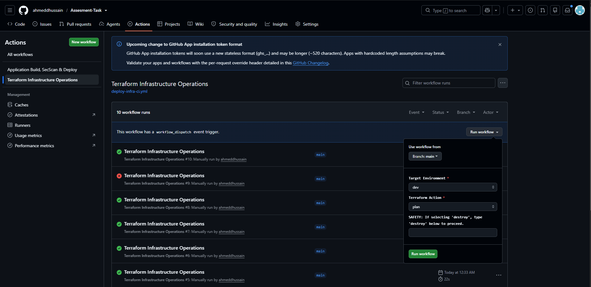

### 5. Deploy Application Services
Push any change under `app/**` to `main`. The pipeline automatically tests, builds, scans with Trivy, signs with Cosign, registers updated task definitions with immutable SHA tags, and triggers zero-downtime rolling updates.

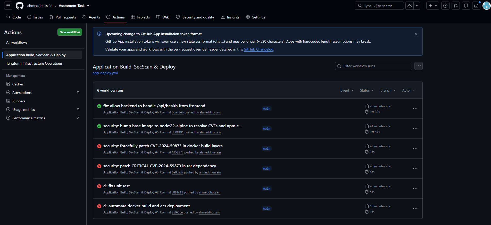

---

## Infrastructure as Code (Terraform)

All cloud infrastructure is organized in modular Terraform directories:

```text
terraform/
├── backend.tf                  # S3 remote state, native locking (TF 1.10+)
├── providers.tf                # AWS + random providers, default_tags
├── variables.tf                # Input variables (no hardcoded secrets or personal emails)
├── main.tf                     # Root module orchestration
├── outputs.tf                  # ALB DNS and RDS endpoint
├── .terraform.lock.hcl         # Committed provider version lock
└── modules/
    ├── networking/             # VPC, dynamic AZ subnets, IGW, NAT Gateway, route tables
    ├── database/               # RDS MySQL 8.0, subnet group, KMS encryption, random_password
    ├── secrets/                # Fixed-name Secrets Manager secret and JSON values
    ├── compute/                # ALB, target groups, ECS Fargate, task defs, ECR, IAM, log groups
    └── monitoring/             # 4 CloudWatch alarms, SNS topic, email subscription
```

**Explicit Dependency Flow:**
$$\text{Networking} \longrightarrow \text{Database} \longrightarrow \text{Secrets} \longrightarrow \text{Compute} \longrightarrow \text{Monitoring}$$

### Module Highlights
 **`networking`:** 
- Dual-AZ VPC (`10.0.0.0/16`) using dynamic `data.aws_availability_zones` lookups. Public subnets route to IGW; private subnets route to a single NAT Gateway.

**`database`:** 
- Encrypted `db.t3.micro` RDS MySQL 8.0. Master password is generated via `random_password`. Configured with explicit `multi_az = false`, 1-day backup retention, and no blanket egress rule on its security group.

**`secrets`:** 
- Single AWS Secrets Manager secret with a fixed name (`${var.environment}-app-secrets`) and `recovery_window_in_days = 0`, ensuring repeatable applies without resource replacement.

**`compute`:** 
- Hardened ALB (`drop_invalid_header_fields = true`), path routing rules, and ECS Fargate services with deployment circuit breaker (`rollback = true`). Services include `lifecycle { ignore_changes = [task_definition] }` so CI-driven deployments are not reverted by subsequent Terraform applies.

 **`monitoring`:** 
 - Provisions managed CloudWatch log groups with 14-day retention, four metric alarms, and an SNS alerting topic.

---

## Security & Least Privilege

### IAM Least Privilege

| Identity | Security Scope |
|---|---|
| **GitHub Actions Role** | Assumed strictly through OIDC; no long-lived access keys. Trust policy validates repo claim `repo:ahmeddhussain/Assesment-Task:*`. |
| **ECS Task Execution Role** | Assumed by the **AWS ECS Agent** at launch (outside the container). Grants permissions to pull images from Amazon ECR, stream logs to CloudWatch (`PutLogEvents`), and decrypt credentials from Secrets Manager (`secretsmanager:GetSecretValue` on `${var.app_secret_arn}*`). |
| **ECS Task Role** | Assumed by the **application code at runtime** (inside the container). Scoped with **zero AWS permissions** (strict least privilege): because the Node.js API connects to MySQL over standard TCP (:3306) and makes no AWS SDK calls, a compromised container possesses no AWS credentials to access cloud APIs. |

### Network Micro-Segmentation

```text
[ Internet ]
     │ (Port 80 only - drops invalid headers)
     ▼
[ ALB Security Group ]
     │ (Port 8080 & 3000 strictly from ALB SG ID)
     ▼
[ ECS Container Security Group ]
     │ (Port 3306 strictly from ECS Task SG ID - No blanket egress)
     ▼
[ RDS Database Security Group ]
```

* Compute tasks and databases have **no public IP addresses**.
* ALB listener strictly forwards `/api/*` to the backend. Internal diagnostic paths (`/health`, `/metrics`) return the default frontend when accessed via the public ALB DNS.

### Data Protection & Cryptography
* **At Rest:** RDS storage is encrypted using AWS KMS (`storage_encrypted = true`). ECR repositories enable AES-256 server-side encryption. Secrets Manager encrypts data at rest using KMS.
* **In Transit:** Internal VPC traffic runs on isolated private AWS fibers. HTTP is used at the public edge to fit the sandbox scope, with HTTPS planned via ACM for production.
* **Information Leakage Prevention:** The application health check responds with generic `503 Service Unavailable` on failures; database exception traces are confined to CloudWatch Logs.

---

## Secrets Management

Static secrets are completely excluded from Git repositories, `.tfvars`, and Docker images.

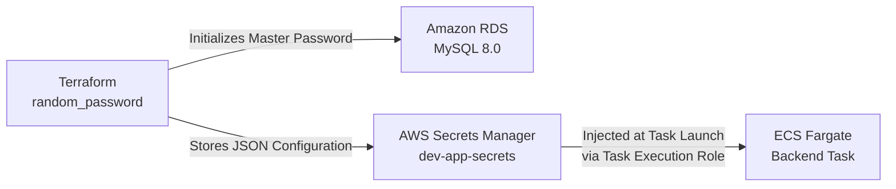

### Injected JSON Payload
```json
{
  "DB_HOST": "dev-mysql-db.c83skyye8aus.us-east-1.rds.amazonaws.com",
  "DB_USER": "dbadmin",
  "DB_PASS": "<generated_cryptographic_password>",
  "DB_NAME": "devopsdb",
  "PORT": "3000"
}
```

The ECS Task Definition maps each JSON key directly to a container environment variable. Plaintext secrets are never stored on container disks or written to standard logs.

---

## Containerization & Supply Chain Security

### Docker Hardening
* **Multi-Stage Builds:** Development tools, compilers, and test suites are isolated to builder stages.
* **Deterministic Installs:** Backend uses `npm ci --omit=dev` with a committed `package-lock.json` to ensure reproducible builds.
* **Minimal Base Images:** Built on Alpine Linux (`node:22-alpine` and `nginxinc/nginx-unprivileged:alpine`).
* **Non-Root Execution:** Backend executes under `USER nodeapp` (UID 1000); Frontend executes under `USER nginx` (UID 101).
* **Build Context Hygiene:** `.dockerignore` files exclude local logs, `.git`, test files, and documentation.
* **Container Healthchecks:** Dockerfiles define native `HEALTHCHECK` directives for local and orchestration health evaluation.

### DevSecOps Supply Chain Pipeline

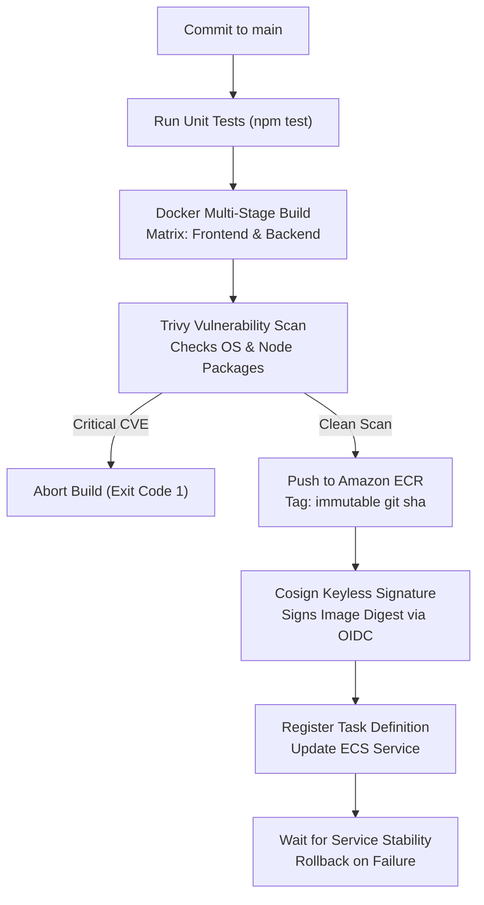

* **Vulnerability Scanning (Trivy):** Pinned Trivy action (`aquasecurity/trivy-action@0.28.0`) scans each image and fails on `CRITICAL` severity findings before push.
* **Cryptographic Provenance (Cosign):** Keyless signing attaches cryptographic provenance to the immutable **image digest** in ECR using the GitHub Actions OIDC identity.
* **Immutable Deployments:** ECS task definitions explicitly reference the exact `:git-sha` image tag rather than `:latest`.

---

## CI/CD Pipelines

Infrastructure and application delivery lifecycles are decoupled into separate workflows:

### 1. Infrastructure Pipeline (`deploy-infra-ci.yml`)
* **Trigger:** Manual execution (`workflow_dispatch`).
* **Inputs:** Environment (`dev`, `staging`, `prod`), Action (`plan`, `apply`, `destroy`), `confirm_destroy`.
* **Linting:** Pre-flight `terraform fmt -check` validation.
* **Destruction Guardrail:** Validates that `confirm_destroy` matches `"destroy"` without unquoted shell interpolation before running destructive operations.

### 2. Application Pipeline (`app-deploy.yml`)
* **Trigger:** Pushes to `main` touching `app/**` or manual execution.
* **Stages:**
  1. **Unit Testing:** Runs backend tests (`npm test`) covering metrics endpoints, 404 handlers, and safe database error handling.
  2. **Matrix Build:** Builds backend and frontend in parallel, tagging images with `${{ github.sha }}`.
  3. **Security Gate:** Runs Trivy scans on both images; deployments proceed only if **both** images pass.
  4. **Signing:** Cosign signs the pushed ECR image digests.
  5. **Continuous Deployment:** Registers a new task definition revision referencing the `${{ github.sha }}` tag, updates ECS services, and executes `aws ecs wait services-stable`. If the rollout fails, the ECS deployment circuit breaker automatically rolls back to the last healthy revision.

| ECS Cluster Overview | Backend Service Deployment | Frontend Service Deployment |
| :---: | :---: | :---: |
| 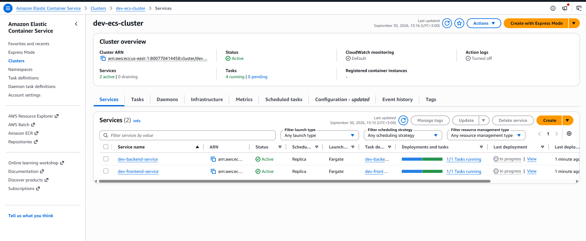 | 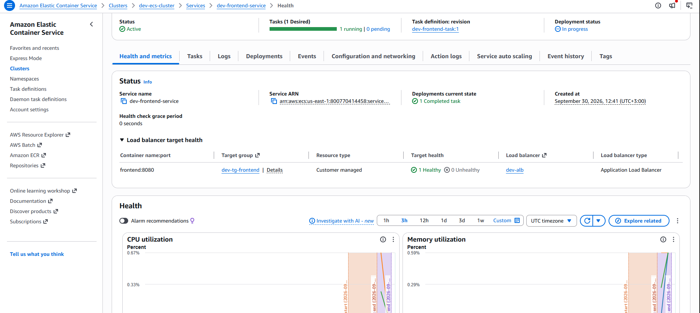 | 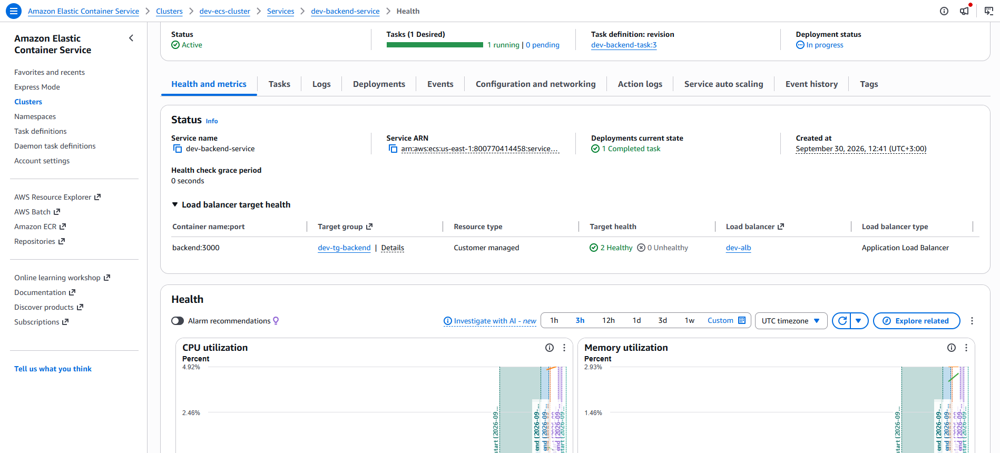 |

---

## Monitoring, Logging & Alerting

### Centralized Logging
* Both task definitions route output using the `awslogs` driver.
* Log groups `/ecs/dev-frontend` and `/ecs/dev-backend` are **provisioned and managed by Terraform** with a 14-day retention policy to prevent cost sprawl.
* Nginx access logs route to the frontend group; Node.js startup, connection, and handled error logs route to the backend group.

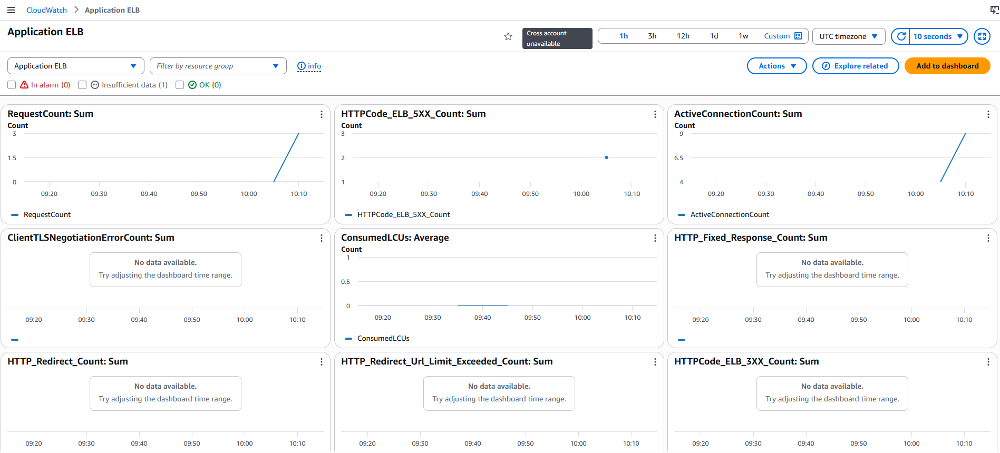

| Log Groups Overview | Backend Container Logs | Frontend Access Logs |
| :---: | :---: | :---: |
| 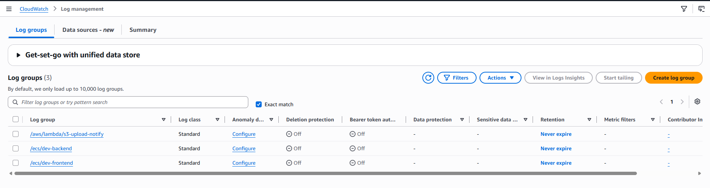 | 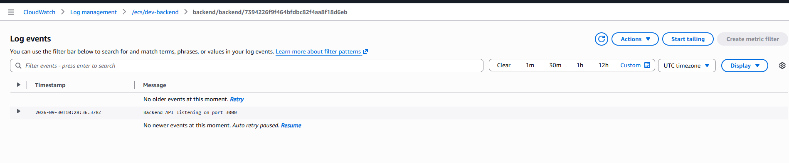 | 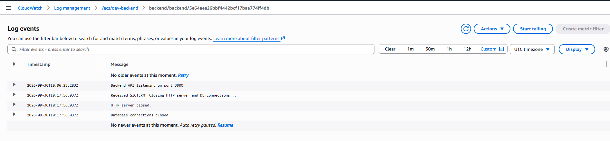 |

### Metrics Collection
* **ECS Fargate:** Real-time collection of `CPUUtilization` and `MemoryUtilization`.
* **ALB:** Telemetry tracking `RequestCount`, `ActiveConnectionCount`, `ConsumedLCUs`, and HTTP status codes (`HTTPCode_Target_5XX_Count`, `HTTPCode_ELB_5XX_Count`).
* **RDS:** Tracks `FreeStorageSpace` and database connection metrics.

### Automated CloudWatch Alarms
All alarms notify the `dev-infrastructure-alerts` SNS topic, which forwards alerts to `ALERT_EMAIL`:

| Alarm Name | Metric Evaluated | Threshold | Operational Objective |
|---|---|---|---|
| `dev-alb-high-5xx-errors` | `HTTPCode_Target_5XX_Count` | `> 5 in 1 minute` | Detects backend 5XX error spikes |
| `dev-backend-unhealthy-hosts` | `UnHealthyHostCount` | `>= 1 for 1 minute` | Detects failing container healthchecks |
| `dev-backend-cpu-high` | `CPUUtilization` | `> 80% for 5 minutes` | Early warning for compute saturation |
| `dev-rds-low-storage` | `FreeStorageSpace` | `< 5GB for 5 minutes` | Prevents database disk exhaustion |

---

## System Verification & Live Testing

### 1. End-to-End 3-Tier Connectivity Test
Load the public application entrypoint:
```text
http://dev-alb-1624663385.us-east-1.elb.amazonaws.com/
```
The browser loads the SPA from Nginx, makes an asynchronous GET call to `/api/health`, and verifies backend connectivity. The backend successfully executes `SELECT 1` against RDS MySQL and displays a green **SUCCESS** card.

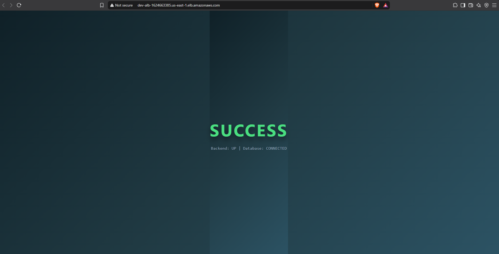

### 2. Network Isolation Penetration Test
Verify that the database is completely inaccessible from the public internet:
```bash
nc -zv -w 3 dev-mysql-db.c83skyye8aus.us-east-1.rds.amazonaws.com 3306
```
* **Result:** `Connection timed out`. Confirms that private subnets and security group chaining drop all external traffic.


### 3. Load Testing & CloudWatch Metric Spike
Generate synthetic traffic to verify telemetry ingestion:
```bash
for i in {1..100}; do curl -s -o /dev/null -w "%{http_code}\n" http://dev-alb-1624663385.us-east-1.elb.amazonaws.com/; done
```
* **Result:** CloudWatch captures all 100 requests. In the Application ELB dashboard, `RequestCount` peaks at 42 requests in the busiest 1-minute bucket, and `ActiveConnectionCount` peaks at 19 concurrent connections.

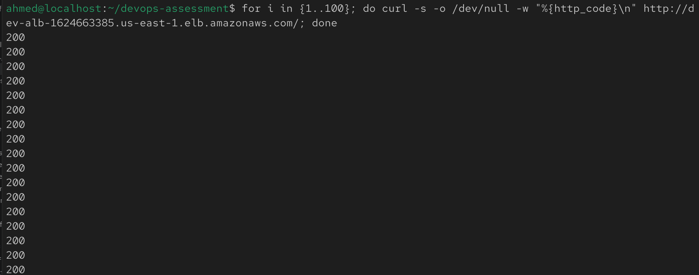

| ALB Request Count Spike | ALB Active Connections Peak |
| :---: | :---: |
| 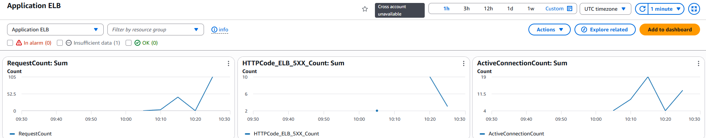 | 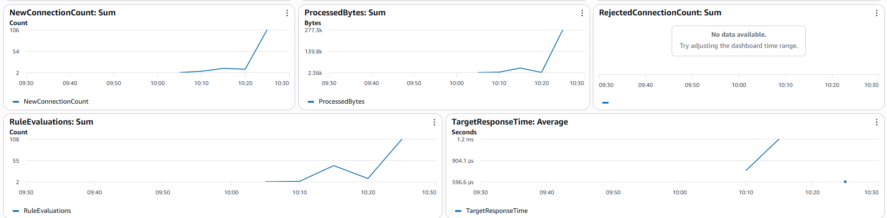 |

### 5. Alarm Notification Test
Verify the end-to-end alerting pipeline using the CLI:

* **Result:** The alarm flips to **RED (`In alarm`)** in CloudWatch, and an SNS notification email is delivered immediately to the subscriber.


| AWS CLI Execution | CloudWatch Alarm Triggered | Alert Email Delivered |
| :---: | :---: | :---: |
| 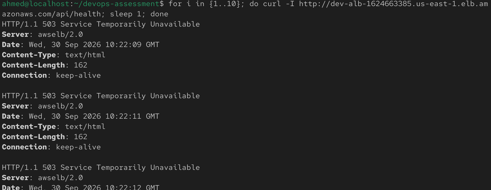 | 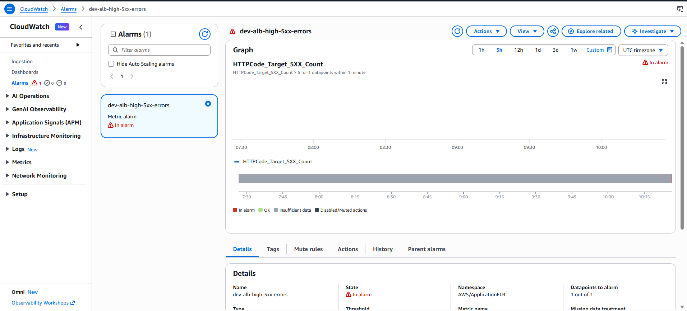 | 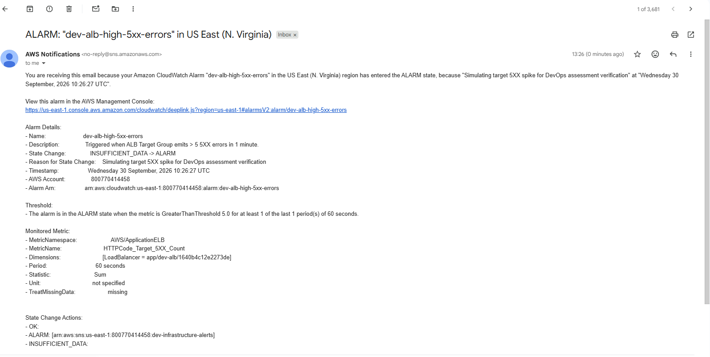 |

---

## Trade-offs & Cost Notes

Practical compromises made to align with the 4–6 hour scope and AWS sandbox budget:

* **Hourly Billed Ingress & Egress:** Managed RDS (`db.t3.micro`) and Fargate fall within low-cost/free tiers, but the **NAT Gateway and ALB are billed hourly**. The infrastructure was destroyed after verification.
* **Single-AZ Database & Single NAT Gateway:** Reduces sandbox costs by avoiding multi-AZ hourly multipliers, trading high availability for cost efficiency.
* **HTTP-Only Public Entrypoint:** Avoids requiring a registered domain and public ACM certificate validation.
* **Image Provenance vs Admission Enforcement:** Images are signed with Cosign to establish build provenance. Admission-controller signature verification is not enforced at Fargate launch time.
* **Single State Key:** A single state key is used in `backend.tf` for this assessment demo. Multi-environment architectures would use dedicated state prefixes per environment.

---

## Production Considerations

To evolve this architecture for a high-traffic, multi-tenant enterprise deployment:

* **Scale:** Configure ECS Service Auto Scaling with Target Tracking policies (CPU > 70%, ALB Request Count Per Target). For microservice architectures, migrate to Amazon EKS managed via ArgoCD, separating application source code from deployment manifests across staging and production branches.
* **High Availability:** Enable `multi_az = true` on Amazon RDS for automated standby replica failover. Deploy one NAT Gateway per Availability Zone to remove cross-AZ failure domains, and maintain a minimum of two Fargate tasks per service distributed across AZs with termination protection enabled.
* **Cost Optimization:** Implement AWS PrivateLink (VPC Endpoints) for ECR, S3, Secrets Manager, and CloudWatch to eliminate NAT Gateway data processing fees. Adopt AWS Fargate Spot for non-production environments (saving up to 70%), baseline steady-state capacity using Compute Savings Plans, and enable RDS Storage Autoscaling.
* **Edge Security & Compliance:** Register custom domains via Amazon Route 53, terminate TLS using AWS Certificate Manager (ACM), enforce HTTP-to-HTTPS redirection, and attach AWS WAF to the ALB for OWASP Top 10 mitigation and rate limiting. Separate staging and production workloads into isolated AWS accounts using AWS Organizations.

---